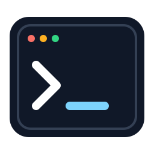

# Codex Terminal

[简体中文](README.md) | English

[](plugins/codex-terminal/.codex-plugin/plugin.json)
[](plugins/codex-terminal/skills/control-codex-terminal/SKILL.md)
[](scripts/validate.sh)
[](LICENSE)
[](https://github.com/cambria-tech/cambria-tech-marketplace/commits/main)

<p align="center">
  
</p>

<p align="center"><strong>A visible, interactive Terminal surface for Codex tasks.</strong></p>
<p align="center">Create a real PTY, display it inside Codex, share control with the user, work in nested SSH or CLI sessions, and close it safely.</p>
<p align="center">Published by <a href="https://www.cambria-tech.com">Cambria Tech</a> through the Cambria Tech Marketplace.</p>

## Contents

- [Why Codex Terminal](#why-codex-terminal)
- [Install from GitHub](#install-from-github)
- [Use the plugin](#use-the-plugin)
- [Update or remove](#update-or-remove)
- [Capabilities and boundaries](#capabilities-and-boundaries)
- [Repository structure](#repository-structure)
- [Development and validation](#development-and-validation)
- [Contributing](#contributing)
- [License and contact](#license-and-contact)

## Why Codex Terminal

Codex Terminal gives an explicitly selected terminal task a real interactive PTY and a native Codex Terminal tab. Unlike a hidden one-shot shell command, the session remains visible and writable, so the user and Codex can follow the same output, take turns typing, answer prompts, interrupt foreground work, and move through nested shells without losing session context.

The plugin is guidance for Codex rather than a privilege boundary. It keeps the host's workspace, sandbox, approval, secret-handling, SSH host-key, and destructive-action safeguards in force.

## Install from GitHub

### Requirements

- A current Codex desktop or CLI installation with `codex plugin` support.
- A local Codex task. Native Terminal tabs are unavailable to cloud-only tasks.

Register the published marketplace, install the plugin, and verify discovery:

```sh
codex plugin marketplace add cambria-tech/cambria-tech-marketplace
codex plugin add codex-terminal@cambria-tech-marketplace
codex plugin list --marketplace cambria-tech-marketplace
```

Start a new Codex task after installation so Codex discovers the skill. Existing tasks do not automatically gain newly installed plugin capabilities.

## Use the plugin

Select `@codex-terminal` in a new local task, or make the surface requirement explicit in your request. For example:

```text
Use @codex-terminal to create and show an interactive Terminal for this task.
使用 @codex-terminal 创建并显示一个我可以接管的交互式终端。
Use @codex-terminal to open SSH through my configured host alias.
```

When explicitly selected, the plugin requires the native Codex Terminal surface. If the host cannot create or display a controllable PTY, Codex should report the missing capability instead of silently substituting a hidden shell.

For passwords, passphrases, MFA codes, recovery codes, and other secrets, take control of the visible Terminal and type them there. Do not send secrets through chat.

## Update or remove

Refresh the GitHub marketplace snapshot, reinstall the current plugin version, and then start a new task:

```sh
codex plugin marketplace upgrade cambria-tech-marketplace
codex plugin add codex-terminal@cambria-tech-marketplace
```

Remove the installed plugin when it is no longer needed:

```sh
codex plugin remove codex-terminal@cambria-tech-marketplace
```

## Capabilities and boundaries

| Area | Supported behavior |
| --- | --- |
| PTY lifecycle | Create, display, reuse, inspect, interrupt, and close a persistent interactive session |
| Shared control | Hand input to the user and recover safely before Codex resumes typing |
| Nested sessions | Track local shells, SSH, REPLs, database CLIs, and container shells |
| Long-running work | Keep foreground commands visible and poll without unrequested background processes |
| Control input | Send intentional `Control-C`, `Control-D`, `Control-Z`, or Escape only after inspecting state |
| Languages | Recognize terminal intent in Chinese, English, Japanese, Korean, Spanish, French, German, Portuguese, Russian, and Arabic |
| Safety | Preserve Codex permissions, sandboxing, approvals, host-key verification, and destructive-action checks |

The plugin does not prove a deployment, migration, upload, or remote service is healthy merely because a command exits successfully. Verify consequential results at the appropriate application or infrastructure layer.

## Repository structure

```text
.
├── .agents/plugins/marketplace.json       # Published marketplace catalog
├── plugins/codex-terminal/
│   ├── .codex-plugin/plugin.json          # Package and presentation metadata
│   ├── assets/                            # Reviewable SVG artwork
│   └── skills/control-codex-terminal/     # Terminal behavior and agent metadata
├── scripts/validate.sh                    # Complete repository validation gate
├── AGENTS.md                              # Contributor and agent guidance
├── README.md                              # Chinese documentation
├── README.en.md                           # English documentation
└── LICENSE                                # MIT license
```

The plugin has no runtime environment variables, external service credentials, package manager, compilation step, or deployment process.

## Development and validation

Clone the repository and run the complete portable gate:

```sh
git clone https://github.com/cambria-tech/cambria-tech-marketplace.git
cd cambria-tech-marketplace
./scripts/validate.sh
```

The script parses the marketplace and plugin manifests, Agent YAML, and every SVG; checks metadata alignment and marketplace policy; rejects placeholders, machine-specific paths, embedded base64 images, external metadata icons, and common private-key or token material; then runs the official plugin and skill validators when those local Codex skills are available.

`CODEX_PYTHON` and `CODEX_SKILLS_ROOT` are optional validation-only overrides for locating a Python interpreter with PyYAML and the local official validator skills. Portable validation requires `python3`, Ruby, `xmllint`, and `rg`.

Behavioral changes also require a local Codex acceptance pass: create and display a PTY, send harmless input, read the mounted Terminal, enter and exit a nested shell, interrupt a foreground command, recover after user handoff, and confirm a clean exit. Record any host capability that could not be exercised.

## Contributing

Read [AGENTS.md](AGENTS.md), keep changes focused, and use `type: 中文描述` Conventional Commit titles. Synchronize user-visible metadata across `plugin.json` and `openai.yaml`. Pull requests should describe the visible behavior change, list validation performed, link related issues, and include before/after images for artwork or presentation changes.

## License and contact

Released under the [MIT License](LICENSE). Published and maintained by [Cambria Tech](https://www.cambria-tech.com). Contact: [cloud@cambria-tech.com](mailto:cloud@cambria-tech.com).
